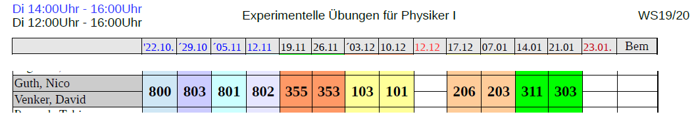
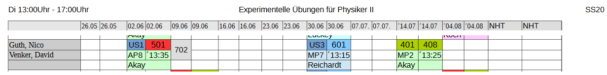

# Anfängerpraktikum (Physik) - TU Dortmund
## David und Nico

## Versuchsübersicht ##
### Erstes Semester ###
#### Vorversuche: ####  
**V800 Das Oszilloskop**  
**V801 Messübung**  
**V802 Fouriersynthese**  
**V803 Das Hooksche Gesetz**  

#### Präsenzversuche: ####  
**V101 Das Trägheitsmoment**  
V102 Drehschwingungen  
**V103 Biegung elastischer Stäbe**  
V106 GekoppeltePendel  
V107 Höppler Viskosimeter  
V201 Das Dulong Petitsche Gesetz  
**V203 Verdampfungswärme**  
V204 Wärmeleitfähigkeit  
**V206 Die Wärmepumpe**  
V302 Brückenschaltungen  
**V303 Der Lock-In-Verstärker**  
V308 Magnetfelder und Spulen  
**V311 Der Hall-Effekt**  
**V353 RC-Kreis**  
V354 Gedämpfte und erzwungene Schwingungen  
**V355 Gekoppelte Schwingkreise**  

### Zweites Semester ###  
#### Onlineversuche: ####  
**V602 Röntgenemission und -absorption  
V603 Compton-Effekt  
V702 Aktivierung mit Neutronen  
V703 Geiger-Müller-Zählrohr**  

#### Präsenzversuche: ####  
**US1 Grundlagen des Ultraschalls**  
US2 Scanverfahren  
**US3 Dopplersonographie**  
**V401 Das Michelson-Interferometer**  
V406 Beugung am Spalt  
**V408 Geometrische Optik**  
V500 Der Photoeffekt  
**V501 Ablenkung eines Elektronenstrahls im elektrischen Feld**   
V502 Ablenkung eines Elektronenstrahls im transversalen Magnetfeld   
V504 Thermische Elektronenemission  
**V601 Der Franck-Hertz Versuch**  
V606 Suszeptibilität paramagnetischer Stoffe  

   

Zum Anlegen eines neuen Versuchs einfach den "template" Ordner kopieren.
Die Dateien "header.tex" und "header-matplotlib.tex" werden dann aus dem "default" Ordner genommen.
Alle Dateien für das Literaturverzeichnis sind im "bib" Ordner.
